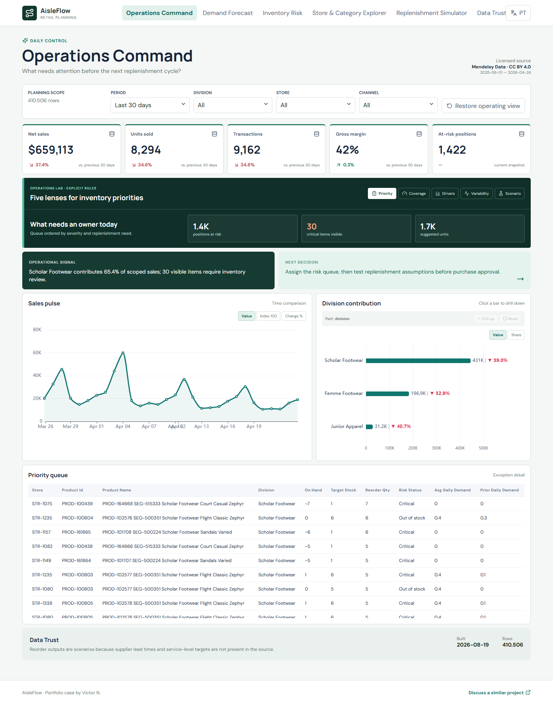

# AisleFlow Retail Planning

A retail operations case for demand forecasting, inventory risk, and replenishment decisions across 40 stores and more than 2,300 products.

**[Open the live demo](https://aisleflow-retail-planning.pages.dev/)** · [Leia em português](README.pt-BR.md)



## Business problem

Stock counts alone do not reveal where working capital or service level is at risk. AisleFlow combines recent demand velocity with current on-hand inventory to produce an exception queue and transparent replenishment scenarios.

## Data

- Source: [Retail Transactions and Stocks Data](https://data.mendeley.com/datasets/27x8mjm8k4/1), DOI `10.17632/27x8mjm8k4.1`.
- License: CC BY 4.0; contributor Jimmy Smith.
- 410,506 sales and inventory records, 40 stores, 2,326 SKUs, and a four-level product hierarchy.
- Raw files stay outside Git; the demo contains only compact derived marts.

## Decision experience

`Operations Command` → `Demand Forecast` → `Inventory Risk` → `Store & Category Explorer` → `Replenishment Simulator` → `Data Trust`

Reorder quantities are scenarios based on configurable cover assumptions. They are never presented as executable purchase orders because supplier lead time, minimum order, and service targets are absent from the source.

### Operations Lab

Every page uses five complementary lenses instead of repeating the KPI cards. The command page covers:

- **Priority** creates an owner-ready queue from risk severity and replenishment need.
- **Coverage** compares visible on-hand stock with target stock and quantifies the gap.
- **Drivers** attributes the change versus the previous window to divisions.
- **Variability** measures demand stability with the coefficient of variation.
- **Scenario** applies a transparent 12-day demand sensitivity; it is not a purchase order or forecast.

The secondary labs are purpose-built: forecast accuracy, bias, variability, coverage and demand sensitivity; inventory severity and stock gaps; network contribution and rebalance; replenishment assumptions; and data completeness, integrity, reconciliation, and readiness.

## Architecture

`Mendeley CSV → Python/DuckDB → dbt marts → forecast validation → Parquet/JSON → React + ECharts`

## Run locally

```powershell
python -m venv .venv
.venv\Scripts\pip install -r requirements.txt
npm install
python -m pipeline download
python -m pipeline build
python -m pipeline forecast-evaluate
npm run dev
```

Validate with `python -m pipeline validate`, `pytest`, `npm test`, `npm run build`, and `npm run test:e2e`.

## Portfolio evidence

- Separate sales and inventory grains with store-product reconciliation.
- Rolling-origin comparison between a 28-day moving average and a linear-trend candidate. The simpler baseline remains selected unless the candidate improves RMSE by at least 5%.
- Transparent 14-day inventory-cover scenario.
- Out-of-stock, critical, low-stock, healthy, and excess states.
- Operational exception queue instead of decorative reporting.
- Bilingual responsive application and visible data limitations.

## Client adaptation

Production implementation would connect ERP sales, inventory snapshots, supplier lead times, service levels, and purchasing constraints. [Discuss a similar project](mailto:victorn198@outlook.com).

See [Portuguese documentation](README.pt-BR.md), [complete dashboard guide](docs/DASHBOARD_GUIDE.md), [metric catalog](docs/METRIC_CATALOG.md), and [demo guide](docs/DEMO_GUIDE.md).
## Design innovation

The **Replenishment Simulator** converts filtered demand and stock signals into an editable scenario. Lead time, safety-stock days, and demand variation change the recommendation immediately; the result is explicitly a planning scenario, not an automated purchase order.
