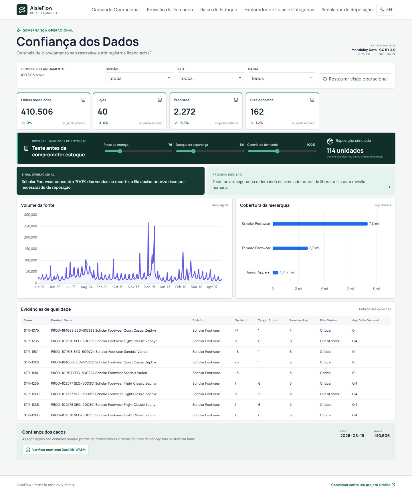

# AisleFlow Retail Planning

## Documentação

- [Guia completo do dashboard](docs/DASHBOARD_GUIDE.pt-BR.md)
- [Catálogo de métricas](docs/METRIC_CATALOG.md)
- [Roteiro de demonstração](docs/DEMO_GUIDE.md)



Case de operações de varejo para previsão de demanda, risco de estoque e reposição em 40 lojas e mais de 2.300 produtos.

## Problema de negócio

Quantidade em estoque não mostra sozinha onde capital de giro ou nível de serviço estão em risco. O AisleFlow combina velocidade recente de demanda e estoque disponível para criar uma fila de exceções e cenários transparentes de reposição.

## Dados e arquitetura

- Fonte real: [Retail Transactions and Stocks Data](https://data.mendeley.com/datasets/27x8mjm8k4/1), CC BY 4.0.
- 410.506 registros de vendas e estoque.
- Pipeline: `CSV → Python/DuckDB → dbt → validação temporal → Parquet/JSON → React/ECharts`.
- Dados brutos não entram no Git.

## Limite importante

A recomendação usa cobertura de 14 dias como cenário. Não é pedido de compra porque a fonte não contém prazo de fornecedor, pedido mínimo ou meta de serviço.

## Execução

```powershell
python -m venv .venv
.venv\Scripts\pip install -r requirements.txt
npm install
python -m pipeline download
python -m pipeline build
npm run dev
```

O case demonstra modelagem de granularidades, baseline de previsão, priorização operacional, interface bilíngue e governança de premissas. [Contato](mailto:comercial@wickoai.com.br).
# Inovação de design

O **Simulador de Reposição** transforma demanda e estoque filtrados em um cenário editável. Prazo de entrega, dias de segurança e variação da demanda alteram a recomendação imediatamente; o resultado é explicitamente um cenário de planejamento, não uma ordem de compra automática.
